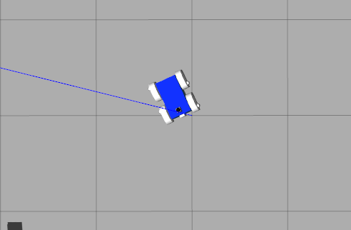

# Project 3, Where Am I?
## Udacity Robotics Software Engineer Nanodegree
Where Am I? project of the Robotics Software Engineer Nanodegree program from Udacity.

## How to Launch the simulation?

#### Clone the package in catkin_ws/src/
```sh
$ cd /home/<project folder>/
$ git clone https://github.com/willhunt/robo_nd_project3.git robo_nd_project3
```

#### Build the `robo_nd_project3` package
```sh
$ cd /home/<project folder>/ 
$ catkin_make
```

#### Make sure to check and install any missing dependencies
```sh
$ rosdep install --from-paths src --ignore-src -r -y
```

#### After building the package, source your environment
```sh
$ cd /home/<project folder>/
$ source devel/setup.bash
```

#### Once the `robo_nd_project3` package has been built, you can launch using:
```sh
$ roslaunch myrobot_main main.launch
```

#### Teleop
If desired the teleop package can be run:
```sh
$ rosrun teleop_twist_keyboard teleop_twist_keyboard.py cmd_vel:=/myrobot_diff_drive_controller/cmd_vel
```

#### Rotation Issue
